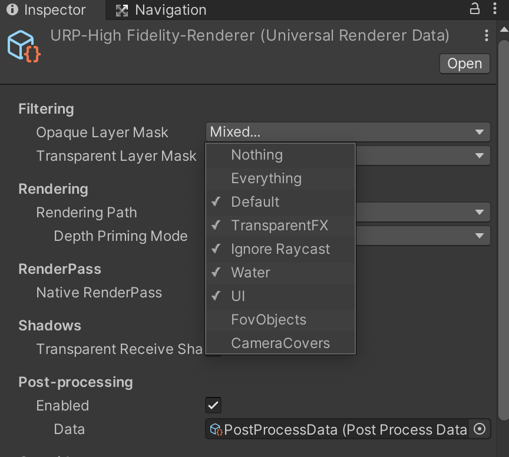
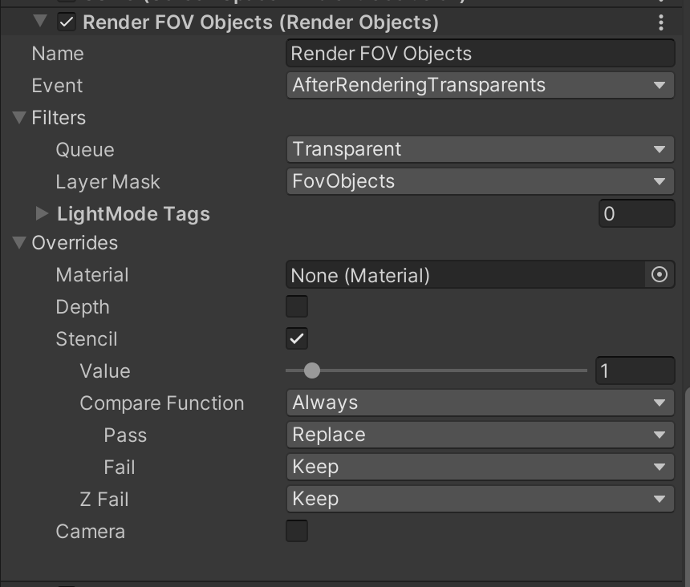
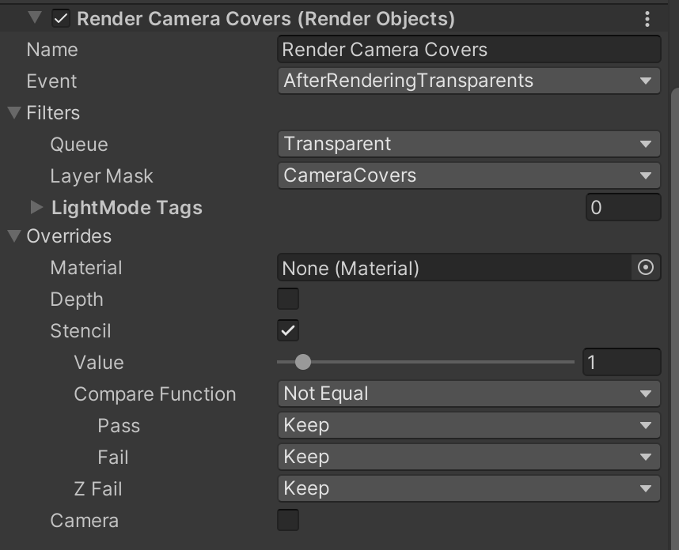

# Field of view prototype with URP in Unity 3D

## Description

This is an example implementation of the field of view in Unity 3D. This example is based on the tutorial by [**Code Monkey**](https://www.youtube.com/watch?v=CSeUMTaNFYk).

## How it works

This example utilize the Universal Render Pipeline features to mask the already rendered image using the stencil buffer. It follows the next steps:

* Create a FOV GameObject
* Create a black layer to cover the camera
* Setup the layers of the objects
* Setup the materials
* Add the render features to the render pipeline

### The Field Of View object

This GameObject is attached to the player and always moves and rotates width the player. It is a dynamic mesh. The mesh is a triangulated circle. The vertices at the perimeter of the circle is always controlled by the scanning rays. Every ray is comming from the origin of the mesh and goes to a direction around the player. Currently it scans in 360 degree using 128 rays. It means every triangles has a `360 / 128 = 2.8125` degree angle. If the ray hits any object within the view distance, the ray will set the vertex on the perimeter to hit position, otherwise it will use the position at the given direction on the maximum view distance.

### The black layer to cover the camera

This is a  plane under the camera. It can have any color. It will cover the non visible area. It should be at least as big to cover the whole screen and not so far away from the camera and not too close. If it is closer than the near clipping distance of the camera, it will not work because the camera cannot see it and will not render it.

### Setup the layers

The FOV object of the player and the black camera cover should have there own layer. It will be used by the render features. In this example the FOV object is on the `FovObjects` layer and the black camera cover is on the `CameraCovers` layer.

### The materials of the object

The FOV object and the camera cover needs to have special materials because of the render features. They will be rendered in the transparent queue after the transparent rendering, so they need to have transparent materials. To avoid issues caused by lighting, use unlit URP and do not cast and use shadows. The FOV objects' material should have 0 alpha to do not display anything.

### The render features

Because this project is using the URP sample template it will contains multiple URP renderers. Each of them is related to one of the quality settings in the project. This example only contains the necessary, settings for the `URP-HighFidelity-Renderer` but the others can also be updated easily following the next steps:

1. Set the filtering in the max layers and do not render the `FovObjects` and the `CameraCovers` layers. 
2. Add a new render feature to only render the objects on the `FovObjects` layer and set the stencil values to 1. 
3. Add a new render feature to render the black camera cover only where the stencil is not 1, so where the player cannot see anything. This render only uses the objects on the `CameraCovers` layer.
