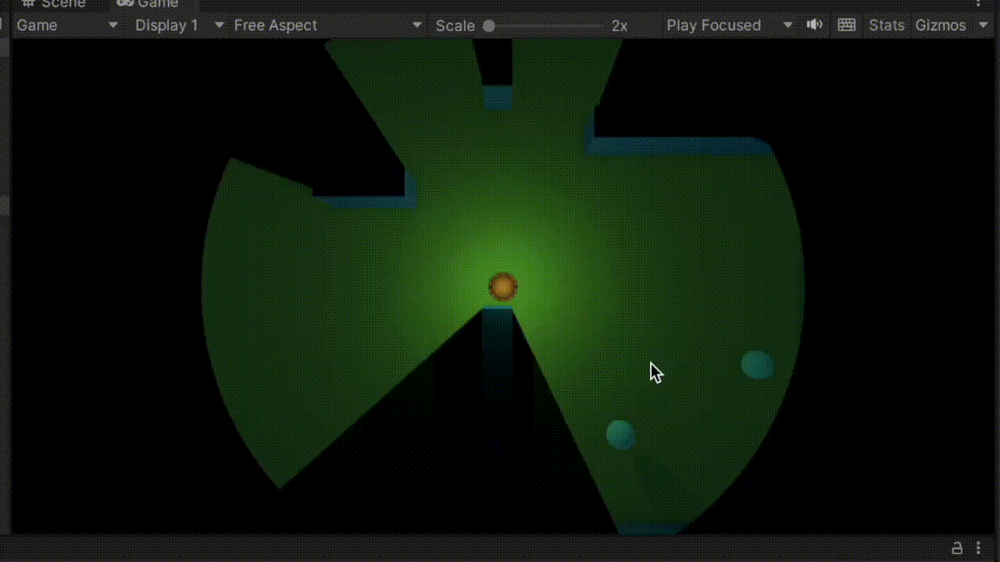

# Field of view prototype with URP in Unity 3D

## Description

This is an example implementation of the field of view in Unity 3D.

## How it works

This example utilize the Universal Render Pipeline features to mask the already rendered image using the stencil buffer. It follows the next steps:

* Create a FOV
